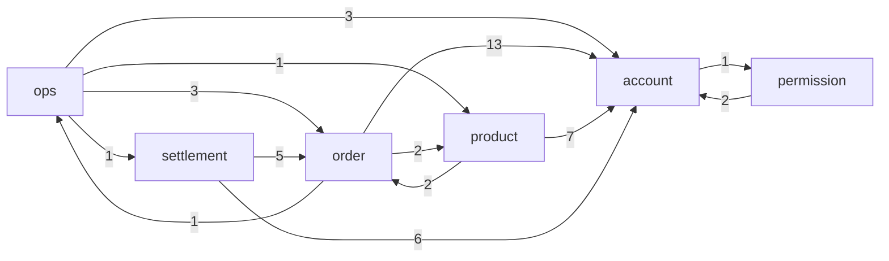

# ERD — 묶음 사이

**생성물이다. 손으로 고치지 않는다** — `SchemaErdTest` 가 스키마에서 뽑는다.

화살표는 **가리키는 쪽 → 가리켜지는 쪽**이고, 수는 그 방향의 외래키 수다.

- [[order]] — 표 20개
- [[product]] — 표 14개
- [[account]] — 표 10개
- [[settlement]] — 표 7개
- [[permission]] — 표 6개
- [[ops]] — 표 8개
