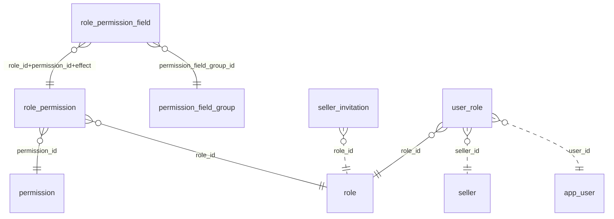

# ERD — permission

**생성물이다. 손으로 고치지 않는다** — `SchemaErdTest` 가 스키마에서 뽑고,
갈리면 빨개진다. 갱신은 `gradlew integrationTest -Dsnapshot.update=true` 다.

점선은 이 묶음 밖으로 나가는 외래키다. 상자만 있고 선이 없는 표는
외래키로 아무것도 안 가리키고 아무도 안 가리키는 표다.
